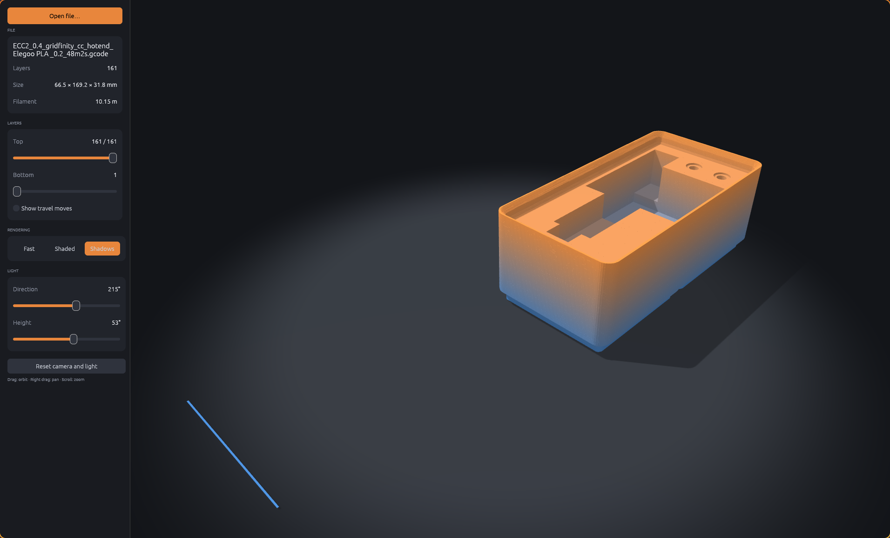

# Gcode Viewer



A standalone 3D G-code viewer for Linux, written in Rust with egui and wgpu. Open a `.gcode` file and orbit the toolpath, scrub through layers and switch between fast flat lines and lit, shadowed rendering.

## Features

- 3D toolpath with orbit, pan and zoom camera
- Navigation cube: drag to orbit, or click a face, edge or corner to snap to that view
- CAD style number key views and an orthographic projection option
- Layer range sliders (top and bottom layer), with a play button that animates the print layer by layer
- Colour by height, speed, layer, feature type (from `;TYPE:` and `; FEATURE:` comments) or filament (tool changes, using the slicer's `filament_colour`)
- File statistics: print time (when the slicer reports it), extrusion and travel move counts, travel distance, tool changes and `M600` pauses, plus filament used per tool
- Optional travel move display
- Three render modes: Fast (flat lines, best for large models), Shaded, and Shaded with shadows
- Adjustable light direction and height
- Parses G0/G1 moves, G2/G3 arcs, relative and absolute positioning and extrusion, and G92 resets
- File manager integration: default opener for `.gcode`, a file type icon, and thumbnails taken from the preview image your slicer embeds in the file

## Build requirements

- Rust (stable, edition 2024)
- A Vulkan capable GPU and driver
- On Fedora: `sudo dnf install rust cargo libxkbcommon-devel wayland-devel`

## Build and run

```bash
cargo run --release -- path/to/file.gcode
```

You can also run it without arguments and use "Open file…", or drop a file onto the window.

## Install

```bash
./scripts/install.sh
```

This builds the project and installs:

- `~/.local/bin/gcode-viewer`
- a desktop entry, app icon and `.gcode` file icon under `~/.local/share`
- a MIME definition for `text/x.gcode`, and sets Gcode Viewer as its default application

### Thumbnails

```bash
./scripts/install.sh --all
```

`--all` also installs the thumbnailer. GNOME runs thumbnailers in a sandbox that can only see `/usr`, so the `gcode-thumbnailer` binary is installed to `/usr/local/bin` with `sudo`, and you will be prompted for your password. Restart your file manager afterwards (`nautilus -q`) so it picks up the new thumbnailer.

Thumbnails only appear for files that contain an embedded preview image (PrusaSlicer, OrcaSlicer and ElegooSlicer all write one).

## Controls

| Input | Action |
|-------|--------|
| Left drag | Orbit |
| Right or middle drag | Pan |
| Scroll | Zoom |
| Navigation cube | Drag to orbit, or click a face, edge or corner to snap to that view |
| `1` / `3` / `7` | Front / right / top view (hold Ctrl for back / left / bottom) |
| `2` / `4` / `6` / `8` | Step orbit by 15 degrees |
| `9` | Flip to the opposite side |
| `5` | Toggle perspective and orthographic projection |
| `0` | Reset the view |
| `Space` | Play or pause the layer animation |
| `C` | Cycle the colour mode |

The number keys work on both the top row and the numpad.

## Limitations

- Layers are detected by Z changes on extruding moves, so vase mode prints show as a single layer
- The whole file is read into memory
- Shaded modes draw every extrusion as geometry and can be slow on very large files, use Fast mode there

## License

GPL-3.0-only. See [LICENSE](LICENSE).
